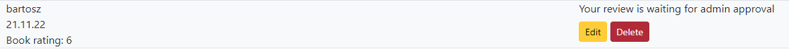

# Lorecraft

Lorecraft is a fictional website for fans of books set in the Warcraft universe. The Warcraft phenomenon began with the first single-player strategy game developed by Blizzard Entertainment in 1994. The game has gone through many instalments, reaching its peak in 2004 when World of Warcraft, a Massively multiplayer online role-playing game, hit store shelves and continues to be developed and played to this day. 
Since the franchise's inception, in the mind of developers and writers, this fantasy world was evolving into something more significant. Chris Metzen's first novel, "Of Blood and Honor", was published in 2001, making it one of few books created before World of Warcraft commercial success. 
Today the Warcraft universe not only consists of multiple games but comics, novels, audio books and even a film. 
Lorecraft application was conceived as a project that creates a safe space to share opinions and popularize lore, present in books and comics that is unknown to many but is set in a universe beloved by millions.


## Table of Contents
* [User-experience Design (UX)](#user-experience-design)
    * [The Strategy Plane](#the-strategy-plane)
        * [Site-goals](#site-goals)
        * [Agile planning](#agile-planning)
            * [Epics](#epics)
            * [User stories](#user-stories)
* [The Scope plane](#the-scope-plane)
* [The Structure plane](#the-structure-plane)
    * [Features](#features)
    * [Features left to implement](#features-left-to-implement)
* [The Skeleton plane](#the-skeleton-plane)
    * [Wireframes](#wireframes)
    * [Database design](#database-design)
* [The Surface plane](#the-surface-plane)
    * [Colour-Scheme](#colour-scheme)
    * [Imagery](#imagery)
* [Technologies and tools](#technologies-and-tools)
* [Testing](#testing)
    * [Django Framework code](#django-framework-code)
* [Deployment](#deployment)
    * [Version control](#version-control)
    * [Clone the Repository locally](#clone-the-repository-locally)
    * [Heroku Deployment](#heroku-deployment)
* [Credits](#credits)
    * [Media](#media)
    * [Honourable mentions](#honourable-mentions)

### User-experience Design 
#### The Strategy Plane 
##### Site-goals 
* Provide a system to express an opinion on any publication and allows its users to rate each title on a standard 1 to 10 scale.
* Built dynamic, expandable application, where content is displayed based on uses interactions.
##### Agile planning
The project was developed by using agile methodologies. The development cycle was divided into five sprints, where code was delivered in small chunks for flexibility and good coding practice.
Furthermore, the branch system was employed to work only on branches, merging a code into the main branch and pushing the code into the production branch, simulating a real-life environment.

The Kanban board was created in order to keep track of project progression and task assessment. Tasks were given acceptance criteria. In addition, they were marked with labels and assigned to project epics.

###### Epics 

1. Base Setup
The base setup epic is for all stories needed for the base set-up of the application. Without initial steps, the development of the application would not be possible under the given conditions and constraints.
1. Prototype
The prototype epic is for all stories needed to create an application prototype. Creating a prototype was an essential step of development, allowing new functionalities to be implemented and tested in a risk-free environment.
1. Review
The review epic is for all stories related to creating, editing and deleting a review. This allows users to interact with the application by adding reviews and ratings to publications.
1. Standalone pages
This epic is for all stories related to small pages and functionalities that don't have their epic. Dependant or tiny features that are not critical but influence the overall experience belongs to this epic.
1. Deployment
This epic is for deployment-related stories. Hosting a site on Heroku, allows users to interact with the application in a live environment.
1. Documentation
This epic is for document-related stories. It provides essential documentation needed to give an insight into the development process and explain all stages of the software production cycle. 

###### User stories 
**EPIC 1: Base Setup**
- As a developer, I have to use linting tools, so my code follows the pep8 standard
- As a developer, I need to set up the project with the core requirements, so I can work on the project

**EPIC 2: Prototype**

- As a developer, I must create a basic structure and style for my content to interact with it and test various ideas.
- As a developer, I need to set up a local database to be able to work with it and be able to correct potential mistakes before committing changes to a remote database
- As a developer, I should add a footer, so a user has quick access to points of interest, located outside of the application 
- As a developer, I need to create the navbar so that users can navigate the website

**EPIC 3: Review**
- As a user, I want to add a review and rate a book to share my opinion with others
- As a user, I want to delete my review if I change my mind and don't want to share my opinion with others
- As a user, I want to edit my review if I change my opinion on a particular book to ensure that it reflects my thoughts

**EPIC 4: Standalone pages**
- As a developer, I need to implement an authentication system so a user can sign in, sign out and interact with the restricted content
- As a developer, I need to prepare a page with all publications, so users can access an item which interests them.
- As a developer, I need to create an index page where users can access highlighted or featured content
- As a developer, I need to create a single book page where crucial information about each publication is visible and dynamically rendered to users
- As a developer, I have to add messages so that the users receive feedback after performing successful actions
- As a developer, I need to add pagination to all books so the user can scroll through the content quickly
- As a developer, I need to implement 404 page if a user tries to access a page that does not exist
- As a developer, I need to implement a 403 page if a user tries to access the page without access rights
- As a developer, I need to implement a 500 error page so users will know when a problem with the server occurred

**EPIC 5: Deployment**
- As a developer, I have to deploy the project so the users can visit the website and interact with the app
- As a developer, I need to migrate my database to retain data since Heroku has ended its support for my plan

**EPIC 6: Documentation**
- As a developer, I need to write README.md so others can check the documentation and gain a better understanding of application principles
- As a developer, I need to write TESTING.md to test the application thoroughly and to allow other testers to follow the same steps in testing process
### The-Scope-Plane
* Responsive design - website should support devices from 320px up
* Hamburger menu for mobile devices
* Review creation, editing and deleting only for registered users
* Publications rating
* Homepage with warcraft-logo lookalike and sorted publications 

[Back to Table of contents](#table-of-contents)
### The Structure plane
#### Features 

``As a developer, I need to create the navbar so that users can navigate the website``

Implementation:

**Navigation menu** 


 * Navigation menu was implemented across all pages 
 * Register and login buttons are visible for users that are not authenticated
 * Hamburger menu is present for greater support for mobile devices


``As a developer, I need to create an index page where users can access highlighted or featured content``

Implementation:

**Index page** 


* Content is sorted by date and by rating 
* Publication cards contain basic information 
* If available, the cover is displayed. If not - placeholder image is used 

``As a developer, I should add a footer, so a user has quick access to points of interest, located outside of the application``

Implementation:

**Footer**


* Fontawesome icons were used for brand icons 
* Links to Github, Linkedin and Facebook open in a new tab

``As a developer, I need to add pagination to all books so the user can scroll through the content quickly``

Implementation: 

**Pagination** 


* content is paginated by three positions for each page 
* user can navigate through each page by using buttons

``As a developer, I need to create a single book page where crucial information about each publication is visible and dynamically rendered to users``

Implementation:

**Single book page**


* full information about each publication is present 
* ratings and reviews, if available, are displayed
* modal was used to present example pages for each book (if available)
* add review button is visible only if a user do not add review for a book


* reviews waiting for approval are only visible for users that created them

``As a user, I want to add a review and rate a book to share my opinion with others``

Implementation:

**Add review**


* only single review is allowed per book for each user 
* rating options are presented in the form of radio buttons 
* review is visible to all other users only after admin approval 

``As a user, I want to edit my review if I change my opinion on a particular book to ensure that it reflects my thoughts``

Implementation:

**Edit review**


* user can edit a review as man time as he wants 
* each edit turns the review status for waiting for approval 

``As a user, I want to delete my review if I change my mind and don't want to share my opinion with others``

**Delete review** 


* review and book context is presented for a user
* user is asked for delete confirmation

``As a developer, I have to add messages so that the users receive feedback after performing successful actions``

Implementation:

**Messages** 


* contextual messages are displayed in response for users actions
* they disappear after certain period of time


``As a developer, I need to implement 404 page if a user tries to access a page that does not exist``

Implementation:

**Error 404 page**

``As a developer, I need to implement a 403 page if a user tries to access the page without access rights``

* Error explanation
* Button that allows to return to the homepage

Implementation: 

**Error 403 page**

``As a developer, I need to implement a 500 error page so users will know when a problem with the server occurred``

* Error explanation
* Button that allows to return to the homepage

**Error 500 page** 

* Error explanation
* Button that allows to return to the homepage

#### Features Left To Implement
* About us page to allow users to contact staff members or administration. Furthermore, marketing information could also be added, as it is a fitting place for such content.
* Staff member account for more accessible and more effective moderation with the project's further development.

[Back to Table of contents](#table-of-contents)
### The-Surface-Plane

#### Colour-Scheme
The choice of the appropriate colour was dictated by the following factors:
- the background should emulate paper
- highlighted section should reflect a connection between the application and Blizzard's productions
With that factors in mind,  colours #0d6efd (blue) and #f8f9fa (grey) were chosen as primary colours for application.


#### Imagery

The hero image was designed in Gimp 2.8.22, with the help of Bevel and Emboss script.

[Back to Table of contents](#table-of-contents)
### The-Skeleton-plane 
#### Wireframes

- Homepage 


- All books page


- Single book page


- Registration(Sign in)


- Log in


- Sign out


- Add review


- Edit review 


- Delete review


[Back to Table of contents](#table-of-contents)
#### Database design
The database was designed to allow users to interact with the application by CRUD principles.  
The book model holds crucial information about each publication, like authors or genres of the book, which are constructed in many to many relationships. Titles and slugs are unique fields for each book object in the database.

The review model is connected with a user by many to one relationship, allowing a single review per book.

Example pages use many to one relationship model, allowing multiple images to be assigned for a single publication.

Each model has datetimefield to store information about the creation of particular content or potential update.

Database diagram was created by using dbdiagram.io 


[Back to Table of contents](#table-of-contents)
### Technologies and Tools

- HTML
  - The structure of the website.
- CSS
  - Content styling
- Javascript
  - modal and messages effects
- Python
  - main programming language for application based on Django Framework
- Visual Studio Code
  - The website was written in Visual Studio Code IDE
- GitHub
  - Source code hosting and deployment
- Git
  - Version control and pushing changes to the repository
- Fontawesome
  - Footer icons
- Gimp
  - Hero image
- FavIcon generator http://tools.dynamicdrive.com/favicon/
  - Favicon
- Balsamiq
  - Wireframes
- dbdiagram.io https://dbdiagram.io/home
  - database diagram

**Python Modules Used**

* Django Class based views (ListView, CreateView, DetailView, CreateView) - classes for template creation
* Mixins (LoginRequiredMixin, UserPassesTestMixin) - enforce login on create a review action
* PermissionDenied - block unauthorized access
* messages - messages in response for user actions
* Avg - average rating calculations
* AbstractUser - extend default User model


**External Python Modules**

* asgiref==3.5.2 - Installed as dependency with another package
* black==22.10.0 - Linting tool
* certifi==2022.9.24 - Installed as dependency with another package
* cffi==1.15.1 - Installed as dependency with another package
* charset-normalizer==2.1.1 - Installed as dependency with another package
* click==8.1.3 - Installed as dependency with another package
* cloudinary==1.30.0 - Serving images for books
* colorama==0.4.5 - Installed as dependency with another package
* cryptography==38.0.1 - Installed as dependency with another package
* defusedxml==0.7.1 - Installed as dependency with another package
* dj-database-url==0.5.0 - Used to parse database url for production environment
* dj3-cloudinary-storage==0.0.6 - Cloudinary storage
* Django==4.1.2 - Framework used to build an application
* django-allauth==0.51.0 - It was used for User Sign in, Sign Out, 
* django-crispy-forms==1.14.0 - Styling of form rendering
* flake8==5.0.4 - checking code against PEP8 standard
* gunicorn==20.1.0 - Installed as dependency with another package
* idna==3.4 - Installed as dependency with another package
* isort==5.10.1 - Sorting imports
* mccabe==0.7.0 - Installed as dependency with another package
* mypy-extensions==0.4.3 - Installed as dependency with another package
* oauthlib==3.2.1 Installed as dependency with another package
* pathspec==0.10.1 - Installed as dependency with another package
* platformdirs==2.5.2 - Installed as dependency with another package
* psycopg2==2.9.4 - Heroku deployment requirement
* psycopg2-binary==2.9.5 - Heroku deployment requirement
* pycodestyle==2.9.1 - Installed as dependency with another package
* pycparser==2.21 - Installed as dependency with another package
* pyflakes==2.5.0 - Installed as dependency with another package
* PyJWT==2.5.0 - Installed as dependency with another package
* python3-openid==3.2.0 - Installed as dependency with another package
* pytz==2022.4 - Installed as dependency with another package
* requests==2.28.1 - Installed as dependency with another package
* requests-oauthlib==1.3.1 - Installed as dependency with another package
* six==1.16.0 - Installed as dependency with another package
* sqlparse==0.4.3 - Installed as dependency with another package
* tomli==2.0.1 - Installed as dependency with another package
* types-cryptography==3.3.23.1 - Installed as dependency with another package
* tzdata==2022.5 - Installed as dependency with another package
* urllib3==1.26.12 - Installed as dependency with another package

[Back to Table of contents](#table-of-contents)
## Testing

Test cases and results can be found in the TESTING.md file.

### Django Framework code
Django framework code was omitted in linting process.

### Deployment
#### Version Control 

The website was created in Virtual Studio Code editor, and changes were pushed to the GitHub repository https://github.com/bartoszgebarowski/lorecraft by using bash terminal. 

The following commands were used:

```git status``` - This command was used to check files staged and not staged for commit

```git add <file.extension>``` -  This command was used to add changes in file/files, with particular names and extensions, to be staged for commit

```git add .``` - This command was used to add changes in all files, regardless of name and extension, to be staged for commit

```git commit -m "commit message"``` - This command was used to commit all staged changes to a local repository

```git push``` - This command was used to upload all committed locally changes to a GitHub repository

```git pull``` - This command was used to pull changes from remote repository into local repository

```git checkout``` - This command was used to switch between branches 

#### Clone the Repository locally 

* Click the Code button
* Navigate to the HTTPS tab
* Click the clipboard copy icon (message "Copied" should appear instead of the icon)
* Choose the IDE with git bash support
* Use command ```git clone copied-url``` into bash terminal


#### Heroku Deployment
1. Navigate to Heroku website. Create an account or sign in to an existing account.
1. Click Create New App button
1. Choose a unique name for your application.
1. Open the "Settings" tab
1. Navigate to Config Vars section, and add the following variables: 
1. Key: PORT, value: 8000
1. Key: DATABASE_URL, value: your_database_url
1. Key: CLOUDINARY_URL, value: your_cloudinary_api_url
1. Key: SECRET_KEY, value: your_secret_key_value
1. Key: DISABLE_COLLECTSTATIC, value: 1
1. Navigate to the Deploy tab and connect the Heroku to Github
1. Choose your Github repository and branch from which the application will be build
1. Choose a method of deployment(Automatic or Manual) and click Deploy branch button

The live link can be found here: https://pp4-lorecraft.herokuapp.com/

### Credits

#### Media 
* http://clipart-library.com/clip-art/142-1420065_out-of-stock-comments-no-access-icon.htm - placeholder image for Book cover
* https://www.amazon.co.uk/ - publication images and descriptions
#### Honourable mentions
* Daisy McGirr - mentor of the Code Institute, whose guidance was invaluable 
* Tobiasz Chodarewicz - a friend whose explanation of various code-related issues allowed me to tackle problems that I have encountered during the development process
* You - for visiting my Repository and reading the documentation

[Back to Table of contents](#table-of-contents)
