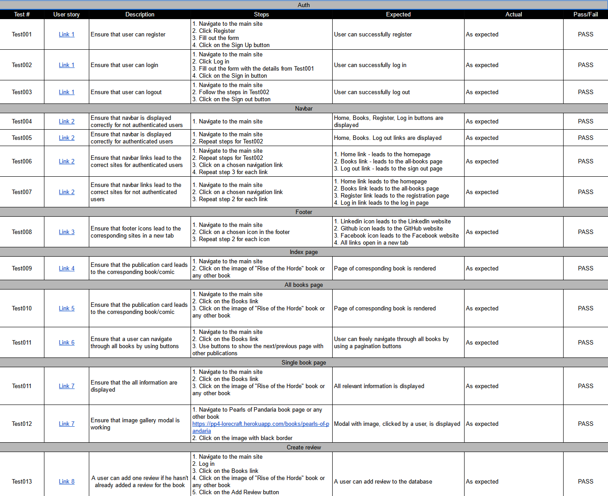
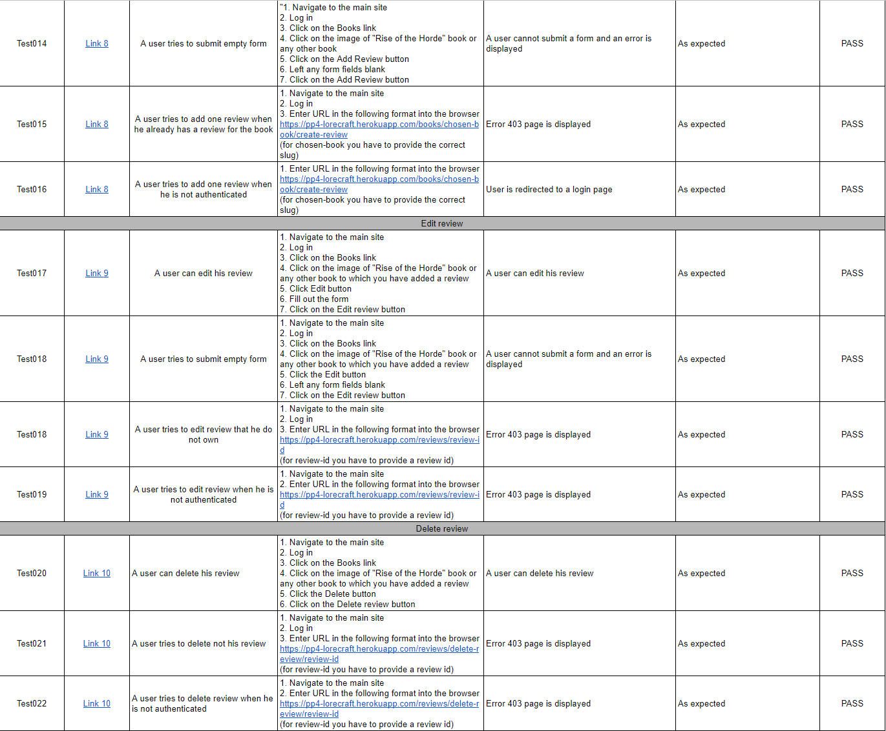
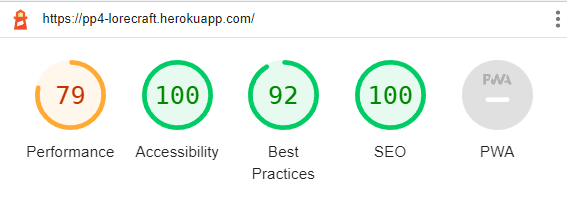
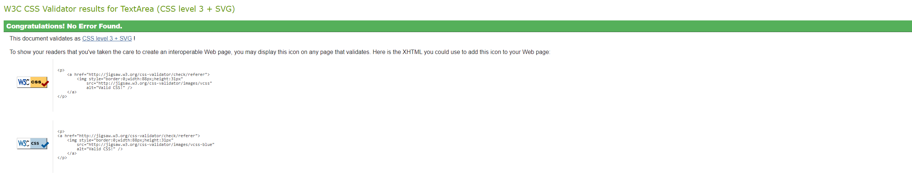

# TESTING 

## User story testing 

[Document can be found here](https://docs.google.com/spreadsheets/d/1_HWfwr6yY_S3sySLqLJQCTCpDgS73YJGy9ymCci5xc0/edit?usp=sharing)

## Responsiveness

All pages were tested to support screen sizes from 320px and upwards.

Steps to test:

1. Open the browser and navigate to [Lorecraft page](https://pp4-lorecraft.herokuapp.com/)
1. Open the developer tools
1. Set to dimensions to responsive
1. Set the zoom to 50%
1. Click the grey bar on the left to change the width

- Website was also opened on the following mobile devices:
Samsung Galaxy S7

## Accessibility

Wave Evaluation Tool was used throughout the development process and for final testing. The following tests were conducted: 

* Webpage structure implementation test
* HTML lang attribute test
* Contrast errors test
* Aria labels implementation test
* Alt attribute implementation test

## Lighthouse 

The performance is on the lower side, as is expected with how the images are served. It can be improved by implementing different, more modern formats before the upload.

## Validators

### HTML

The code passed through W3C Markup validator with no significant issues.

### CSS
The bootstrap css is giving an error in Jigsaw, which is to be expected.

CSS file, included with this project, passed through Jigsaw validator with no significant issues.
### JAVASCRIPT

The code passed through JSHint validator with no significant issues.

### PYTHON 

https://pep8ci.herokuapp.com/ was used. In addition, the test was set up in the Ci.yml for each commit.

### Known bugs 
1. Registration/login forms are broader than they should be when an error is displayed.
2. If a single review is added to a book and it is waiting for admin approval, the review section is empty.
3. Crispy Form generates radio buttons without a fieldset element.

